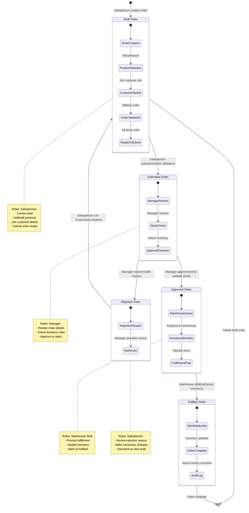
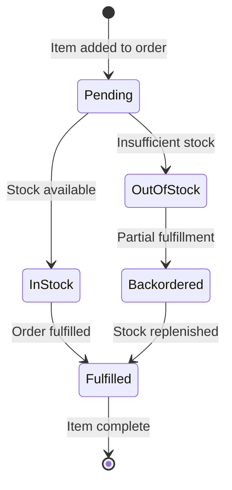

# SaaS Sale Orders - Order Flow Diagram

## Complete Order Workflow

The following diagram shows the complete sale order workflow with role-based transitions and business logic.

## Role-Based Action Matrix

| Status        | Salesperson Actions             | Manager Actions    | Warehouse Actions |
| ------------- | ------------------------------- | ------------------ | ----------------- |
| **Draft**     | ✅ Create, Edit, Delete, Submit | ❌                 | ❌                |
| **Submitted** | ❌                              | ✅ Approve, Reject | ❌                |
| **Approved**  | ❌                              | ❌                 | ✅ Fulfill        |
| **Rejected**  | ✅ Revise → Draft               | ❌                 | ❌                |
| **Fulfilled** | ❌                              | ❌                 | ❌                |

## Order Item Status Flow

## Business Rules & Validations

### Stock Validation Points

1. **Order Submission**: Check stock availability for all items
2. **Manager Approval**: Re-validate stock before approval
3. **Fulfillment**: Final stock check and deduction

### Transition Rules

- **Draft → Submitted**: Requires valid items and customer details
- **Submitted → Approved**: Manager role required, stock must be available
- **Submitted → Rejected**: Manager role required, reason mandatory
- **Approved → Fulfilled**: Warehouse role required, stock deduction occurs
- **Rejected → Draft**: Salesperson can revise and create new draft

### Audit Trail

All status changes are logged in `OrderStatusHistory` with:

- Previous status
- New status
- User who made the change
- Timestamp

## Multi-Tenant Security

### Tenant Isolation

- All queries include tenant context validation
- Row Level Security (RLS) policies enforce data isolation
- API endpoints validate tenant ownership

### Role-Based Access Control

- Users have specific roles: `salesperson`, `manager`, `warehouse`
- Actions are validated against user role and order status
- Cross-tenant data access is prevented

## Real-time Updates

The system supports real-time updates via Supabase Realtime:

- Order status changes broadcast to relevant users
- Stock level updates reflected immediately
- Manager notifications for pending approvals

## Error Handling

### Common Validation Errors

- **Items Required**: Order must have at least one item
- **Stock Unavailable**: Item quantity exceeds available stock
- **Unauthorized**: User lacks permission for requested action
- **Invalid Transition**: Status change not allowed from current state

### Recovery Mechanisms

- Rejected orders can be revised and resubmitted
- Draft orders can be saved and resumed later
- Stock validation occurs at multiple checkpoints
